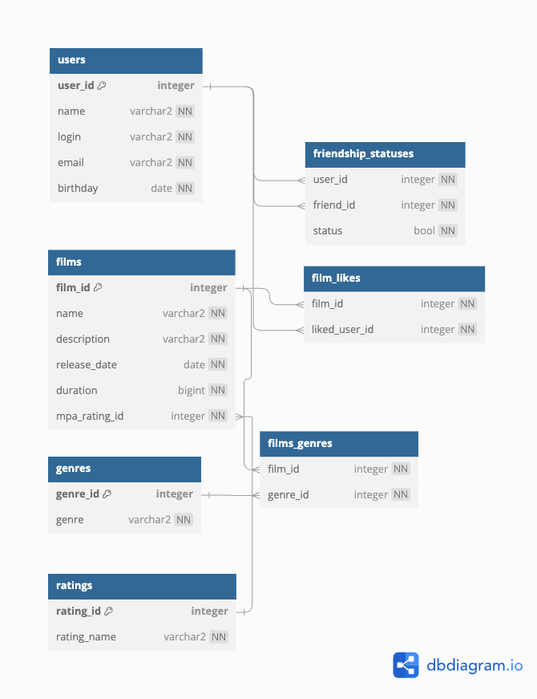

# Project description

Filmorate project

*ER-diagram*


## Link to ER diagram in dbdiagram.io

https://dbdiagram.io/d/66fc3f3bfb079c7ebd0086cb

## Main queries based on data structure FROM diagram

```sql
-- friendship status for 2 users
SELECT * 
FROM friendship_statuses 
WHERE (user_id = <id1> AND friend_id = <id2>)
    OR (user_id = <id2> AND friend_id = <id1>)

-- likes of film
SELECT liked_user_id 
FROM film_likes 
WHERE film_id = <film_id>

-- genres of film
SELECT g.genre
FROM genres
WHERE genre_id in (
    SELECT fg.genre_id
    FROM films f
    INNER JOIN films_genres fg
        ON f.film_id = fg.film_id
    WHERE f.film_id = <film_id>
    )
```